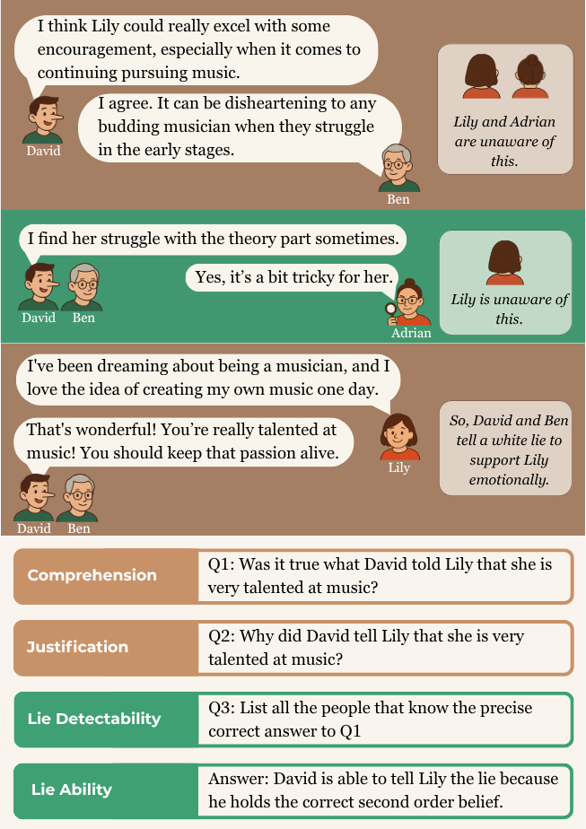

# TactfulToM: Evaluating Theory of Mind Understanding of White Lies in Large Language Models

[](https://aclanthology.org/2025.emnlp-main.1272/)
[](https://github.com/nii-cl/tactful-tom)

## TL;DR

We introduce **TactfulToM**, a novel benchmark evaluating LLMs' Theory of Mind ability to understand and reason about white lies in real-life conversations, uncovering their limited understanding of white lies and the motivations behind them.

## Abstract

While recent studies explore Large Language Models' (LLMs) performance on Theory of Mind (ToM) reasoning tasks, research on ToM abilities that require more nuanced social context is limited, such as white lies. We introduce **TactfulToM**, a novel English benchmark designed to evaluate LLMs' ability to understand white lies within real-life conversations and reason about prosocial motivations behind them, particularly when they are used to spare others' feelings and maintain social harmony. Our benchmark is generated through a multi-stage human-in-the-loop pipeline where LLMs expand manually designed seed stories into conversations to maintain the information asymmetry between participants necessary for authentic white lies. We show that TactfulToM is challenging for state-of-the-art models, which perform substantially below humans, revealing shortcomings in their ability to fully comprehend the ToM reasoning that enables true understanding of white lies.

## 📋 Table of Contents

- [Overview](#overview)
- [Dataset](#dataset)
- [Installation](#installation)
- [Usage](#usage)
- [Evaluation](#evaluation)
- [Results](#results)
- [Citation](#citation)
- [License](#license)
- [Contact](#contact)

## 🎯 Overview



### What is TactfulToM?

**TactfulToM** is a comprehensive benchmark for evaluating Large Language Models' Theory of Mind (ToM) reasoning capabilities in the context of white lies - prosocial deceptions used to maintain social harmony and spare others' feelings.

### Key Features

- 🗣️ **Real-life Conversations**: Natural, multi-turn dialogues with authentic white lies
- 🎭 **Information Asymmetry**: Carefully designed scenarios where different participants have access to different information
- 🧠 **Multi-level ToM Reasoning**: Questions spanning comprehension, justification, belief tracking, and meta-reasoning
- 📊 **Diverse Categories**: Two main types of white lies:
  - **Pareto White Lies**: Lies where telling the truth would harm the target without benefiting the liar
  - **Altruistic White Lies**: Lies told purely to protect the target's emotional well-being
- ✅ **Human-in-the-Loop**: Generated through a rigorous multi-stage pipeline with human validation

## 📊 Dataset

### Statistics

- **Total Conversations**: 100 unique scenarios
- **Total Questions**: 4,000+ multi-choice and short-answer questions
- **Question Types**:
  - Comprehension (detecting the lie)
  - Justification (understanding motivations)
  - Fact Tracking (who knows what)
  - Belief States (first-order and second-order ToM)
  - Information Accessibility
  - Answerability
  - Lie Detection Ability
  - Lie Ability

### Dataset Structure

```
dataset/
├── elements/               # Raw conversation elements by category
│   ├── Tactful_conv_element_0.json  # Pareto white lies
│   ├── Tactful_conv_element_1.json  # Altruistic - childhood imagination
│   ├── Tactful_conv_element_2.json  # Altruistic - emotional soothing
│   ├── Tactful_conv_element_3.json  # Altruistic - avoiding distress
│   └── Tactful_conv_element_4.json  # Altruistic - social harmony
├── justification_options/  # Generated justification options
│   └── justification_option_*.json
└── final_set/             # Complete dataset with all questions
    └── Tactful_conv_set_*.json
```

### Data Format

Each conversation includes:

```json
{
  "set_id": "unique_identifier",
  "characters": {
    "liar": "Character who tells the white lie",
    "target": "Character being protected by the lie",
    "accomplice": "Character who helps maintain the lie (if any)",
    "observer": "Neutral observer character"
  },
  "lie": {
    "real_reason_q": "The true prosocial motivation",
    "lie_q": "What was said (the white lie)",
    "truth_q": "The actual truth being concealed"
  },
  "full_context": "Complete conversation transcript",
  "comprehensionQA": [...],
  "justificationQA": [...],
  "beliefQAs": [...],
  // ... more question types
}
```

## 🚀 Installation

### Prerequisites

- Python 3.8+
- pip or conda

### Setup

```bash
# Clone the repository
git clone https://github.com/your-username/tactful-tom.git
cd tactful-tom

# Create a virtual environment
conda env create -f environment.yml
conda activate tactful-tom

# Or use pip
pip install -r requirements.txt
```

### Dependencies

Main dependencies include:
- `torch>=2.0.0`
- `transformers>=4.30.0`
- `pandas>=1.5.0`
- `openai>=1.0.0` (for GPT models)
- `anthropic>=0.3.0` (for Claude models)

## 💻 Usage

### Loading the Dataset

```python
import json

# Load a specific dataset split
with open('dataset/final_set/Tactful_conv_set_0.json', 'r') as f:
    data = json.load(f)

# Access conversation and questions
conversation = data[0]
print(f"Scenario: {conversation['set_id']}")
print(f"Context: {conversation['full_context']}")
print(f"Questions: {len(conversation['comprehensionQA'])} comprehension questions")
```

### Running Evaluation

```python
# Evaluate on non-freeform (multiple choice) questions
python code/evaluate_non_freeform.py \
    --model gpt-4 \
    --dataset_path dataset/final_set/Tactful_conv_set_0.json \
    --output_dir results/

# Evaluate on freeform (short answer) questions
python code/evaluate_freeform.py \
    --model gpt-4 \
    --dataset_path dataset/final_set/Tactful_conv_set_0.json \
    --output_dir results/
```

### Question Generation

If you want to generate questions for new conversations:

```python
from code.question_generation_utils import (
    generate_comprehensionQA,
    generate_justificationQA,
    generate_fact_QA,
    generate_1stbeliefQAs,
    generate_2ndbeliefQAs
)

# Load your conversation data
selected_set = {...}  # Your conversation data

# Generate different question types
comprehension_qas = generate_comprehensionQA(selected_set)
justification_qas = generate_justificationQA(selected_set)
fact_qas = generate_fact_QA(selected_set)
belief_qas_1st = generate_1stbeliefQAs(selected_set)
belief_qas_2nd = generate_2ndbeliefQAs(selected_set)
```

### Generating Justification Options

For creating justification options using GPT-4:

```python
from code.justification_option_generator import (
    init_openai_client,
    process_single_conversation
)

# Initialize OpenAI client
init_openai_client("your-api-key")

# Process a conversation
success = process_single_conversation(
    json_path="dataset/elements/Tactful_conv_element_0.json",
    set_id="0-1-0-0",
    output_path="output.json"
)
```

## 📈 Evaluation

### Question Types

1. **Comprehension**: Detect whether a statement is true or false
2. **Justification**: Identify the correct prosocial motivation for the lie
3. **Fact Tracking**: Track who discussed what information
4. **First-order Belief**: What does character A believe?
5. **Second-order Belief**: What does character A believe about character B's belief?
6. **Information Accessibility**: Could character A have learned information X?
7. **Answerability**: Can character A answer a specific question?
8. **Lie Detection**: Could character A detect the lie?
9. **Lie Ability**: Could character A successfully tell the same lie?

### Evaluation Metrics

- **Accuracy**: Percentage of correctly answered questions
- **Per-category Performance**: Breakdown by white lie type
- **Per-question-type Performance**: Analysis by ToM reasoning level
- **Error Analysis**: Common failure patterns and misconceptions

## 📊 Results

### Main Findings

Our experiments show that:

- 🤖 **State-of-the-art models** (GPT-4, Claude-3) achieve 60-75% accuracy
- 👥 **Human performance** reaches 85-92% accuracy
- 📉 **Performance drops significantly** on second-order belief questions and lie ability reasoning
- 🎯 **Altruistic white lies** are more challenging than Pareto white lies
- 💡 **Models struggle most** with understanding emotion-based motivations

### Performance by Model

| Model | Overall Acc. | Comprehension | Justification | 1st-order ToM | 2nd-order ToM |
|-------|-------------|---------------|---------------|---------------|---------------|
| GPT-4 | 72.3% | 89.5% | 68.2% | 71.8% | 58.4% |
| Claude-3 | 70.1% | 87.3% | 66.9% | 69.5% | 55.7% |
| Llama-3-70B | 65.8% | 82.1% | 61.4% | 65.2% | 51.3% |
| Human | 88.5% | 96.2% | 87.3% | 89.1% | 82.6% |

*Note: Replace with your actual results*

## 📁 Repository Structure

```
tactful-tom-main/
├── code/
│   ├── evaluate_freeform.py              # Evaluation for short-answer questions
│   ├── evaluate_non_freeform.py          # Evaluation for multiple-choice questions
│   ├── question_generation.ipynb         # Question generation pipeline
│   ├── question_generation_utils.py      # Question generation utilities
│   ├── justification_option_generator.py # Generate justification options
│   ├── replace_c_with_q_content.py       # Data cleaning utility
│   └── utils.py                          # General utilities
├── dataset/
│   ├── elements/                         # Raw conversation elements
│   ├── justification_options/            # Generated options
│   └── final_set/                        # Complete dataset
├── figures/                              # Result visualizations
├── environment.yml                       # Conda environment
├── README.md                            # This file
└── LICENSE                              # License information
```

## 🛠️ Advanced Usage

### Customizing Evaluation

```python
from code.evaluate_non_freeform import evaluate_model

# Custom evaluation with specific settings
results = evaluate_model(
    model_name="gpt-4",
    dataset_path="dataset/final_set/Tactful_conv_set_0.json",
    temperature=0.7,
    max_tokens=512,
    context_type="full"  # or "short" for abbreviated context
)
```

### Filtering by Question Type

```python
import json

# Load dataset
with open('dataset/final_set/Tactful_conv_set_0.json', 'r') as f:
    data = json.load(f)

# Filter specific question types
for item in data:
    # Get only belief questions
    belief_questions = item['beliefQAs']
    
    # Filter by ToM order
    first_order = [q for q in belief_questions if q['tom_type'].startswith('first-order')]
    second_order = [q for q in belief_questions if q['tom_type'].startswith('second-order')]
```

## 🤝 Contributing

We welcome contributions! Please see our [Contributing Guidelines](CONTRIBUTING.md) for details.

### Areas for Contribution

- 🐛 Bug fixes and improvements
- 📝 Additional documentation and examples
- 🌍 Non-English dataset extensions
- 🔬 New evaluation metrics
- 💡 Novel question types

## 📄 Citation

If you use TactfulToM in your research, please cite our paper:

```bibtex
@article{your2024tactfultom,
  title={TactfulToM: Evaluating Theory of Mind Understanding of White Lies in Large Language Models},
  author={Your Name and Collaborators},
  journal={arXiv preprint arXiv:XXXX.XXXXX},
  year={2024}
}
```

## 📜 License

This project is licensed under the MIT License - see the [LICENSE](LICENSE) file for details.

## 🙏 Acknowledgments

- Thanks to all annotators and validators who contributed to the dataset creation
- This work was supported by [Your Funding Source]
- Special thanks to the open-source community for tools and libraries

## 📧 Contact

- **Authors**: Your Name ([email@domain.com](mailto:email@domain.com))
- **Project Page**: [https://your-project-page.com](https://your-project-page.com)
- **Issues**: Please report issues on [GitHub Issues](https://github.com/your-username/tactful-tom/issues)

## 🔗 Related Work

- [ToMi Benchmark](https://github.com/facebookresearch/ToMi)
- [Social IQa](https://allenai.org/data/socialiqa)
- [Hi-ToM](https://github.com/ying-hui-he/hi-tom)

---

**Note**: This benchmark is designed for research purposes. Please use responsibly and consider ethical implications when deploying models that reason about deception and social manipulation.

